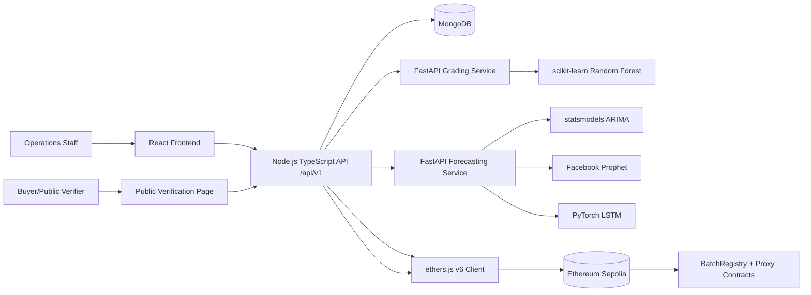

# System Architecture (Phase 1)

## Boundaries

- `backend/` and `blockchain/` are sibling directories to avoid Hardhat 3 ESM conflict with backend module system.
- Only traceability metadata is written on-chain; full records remain in MongoDB.

## Core Data Flow

1. Create supplier and batch records in API.
2. Send grading inputs to grading FastAPI service and persist output.
3. Send demand data to forecasting FastAPI service and persist forecast snapshots.
4. Register batch metadata on Sepolia via ethers.js v6.
5. Verify batch from public page through on-chain lookup.
