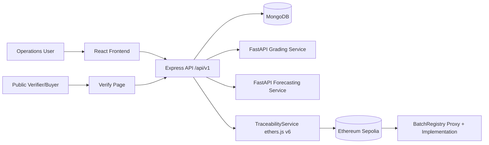
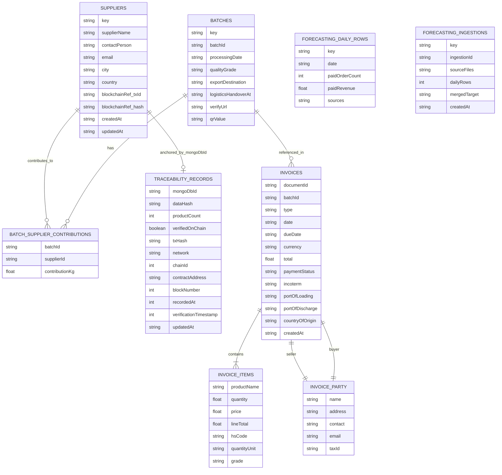
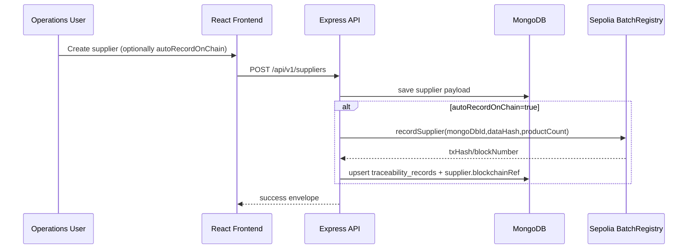
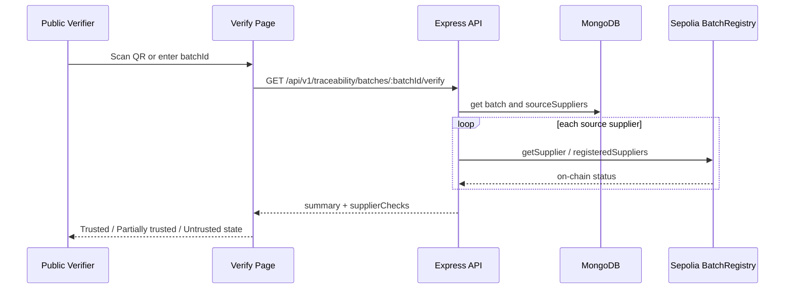
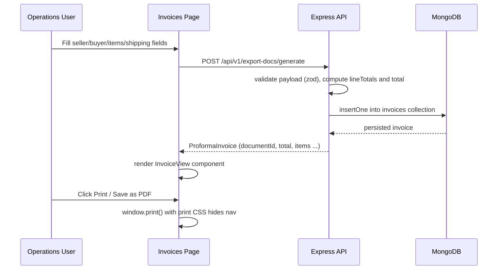

## 1.0 Introduction

This project repository implements an AI-Integrated Supply Chain Management System with Blockchain Traceability for Ceylon Cinnamon Export Operations (Canela Ceylon case study), with six core modules defined in project requirements: Supplier Management, Batch and Inventory Management, Export Documentation, AI Quality Grading, AI Demand Forecasting, and Ethereum Blockchain Traceability. Implemented stack in code is React frontend, Node.js + TypeScript + Express backend, MongoDB persistence, Python FastAPI microservices for grading and forecasting, and Solidity + Hardhat + ethers.js v6 on Sepolia testnet (sources: README.md, docs/requirements.md, frontend/src/App.tsx, backend/src/routes/route-groups.md, blockchain/package.json). Dual role as CEO/researcher: NOT FOUND IN REPO.

## 1.1 Background Studies

- Repo scope and docs frame the domain as Ceylon cinnamon export operations with traceability and AI-assisted operations (README.md, docs/requirements.md).
- On-chain/off-chain boundary is explicitly defined: traceability metadata on-chain, full operational records in MongoDB (README.md, docs/architecture-diagrams/system-architecture.md, backend/src/modules/traceability/README.md).
- Implemented module-level business focus from code:
- Supplier onboarding/profile capture and optional chain registration (backend/src/modules/suppliers/suppliers.routes.ts, frontend/src/pages/suppliers.tsx).
- Batch composition, contribution tracking, and public verification QR link generation (backend/src/modules/batches/batches.routes.ts, frontend/src/pages/batches.tsx).
- AI grading request flow with constrained grading inputs (backend/src/modules/grading/grading.routes.ts, ai-services/grading/api.py).
- Forecasting via model selection and uploaded operational CSV merge (backend/src/modules/forecasting/forecasting.routes.ts, frontend/src/pages/forecasting.tsx).
- Supplier/batch traceability checks and verification states (backend/src/modules/traceability/traceability.routes.ts, frontend/src/pages/traceability.tsx, frontend/src/pages/verify.tsx).
- [REQUIRES YOUR INPUT - industry/domain background needs citations from export board reports, ISO/SLS standards docs, industry statistics]

## 1.2 Problem Statement

- Implicit problem framing from implemented modules:
- Need to digitize supplier and batch records with consistent structure and retrieval APIs (suppliers/batches routes and stores).
- Need reproducible AI-supported grading/forecasting interfaces rather than manual-only decisions (grading/forecasting routes + FastAPI services).
- Need public/verifiable traceability metadata linked to operations (traceability routes + verify page + Sepolia contract integration).
- Need API-level consistency and versioning for multi-module integration (/api/v1 + response envelope).
- Explicit narrative sentence "the problem is ...": NOT FOUND IN REPO - draft this from your own problem framing.

## 1.3 Objective

- Implement Supplier Management CRUD with validated payloads and persisted supplier profiles.
- Implement Batch and Inventory management with supplier contribution capture, generated batch IDs, and inventory aggregation by grade.
- Implement Export Documentation generation endpoint for common export document types.
- Implement AI Quality Grading service integration for cinnamon grade prediction from structured inputs.
- Implement AI Demand Forecasting service integration with model comparison path and ingestion of marketplace CSV exports.
- Implement Ethereum Blockchain Traceability on Sepolia for supplier-level metadata record, verify, hash-verify, and product-count updates.

## 1.4 Solutions

- Supplier module solution: REST supplier listing/creation with zod validation, duplicate checks, and optional auto-record to chain on create.
- Batch/inventory solution: POST batch creates normalized batch ID, stores supplier contributions, and generates QR verification URL + QR image.
- Export-doc solution: POST export-docs/generate validates doc type + batch and returns generated documentId + timestamp payload.
- Grading solution: backend proxy endpoint validates input and forwards to FastAPI model endpoint returning predicted grade.
- Forecasting solution: backend supports direct forecast and ingest-and-predict flow (merge paid rows from website/daraz CSV into daily target, persist, then forecast).
- Traceability solution: Sepolia contract-backed supplier record/verify/update/hash-check operations and batch-level trust summary endpoint for public verification flow.

## 3.0 Planning

- Planning evidence in repo exists as phase plan and task backlog (README.md delivery phases, docs/task-list.md).

### 3.0.1 Feasibility Report

- Technical feasibility evidence:
- Backend has runnable bootstrap with Mongo init + blockchain readiness checks before listen (backend/src/server.ts).
- Frontend route shell with module pages is implemented (frontend/src/App.tsx).
- Smart contract deployment artifact exists with Sepolia proxy/implementation addresses (blockchain/deployments.sepolia.json).
- AI services expose health + predict endpoints with concrete request/response models (ai-services/grading/api.py, ai-services/forecasting/api.py).
- Economic/operational feasibility: [REQUIRES YOUR INPUT]

### 3.0.2 Risk Assessment

- [REQUIRES YOUR INPUT - this is your own project-management judgement, not extractable from code]

### 3.0.3 SWOT

- [REQUIRES YOUR INPUT]

### 3.0.4 PESTAL Analysis

- [REQUIRES YOUR INPUT]

### 3.0.5 Life Cycle Model

- Evidence of phased delivery exists in README (Phase 1 to Phase 6).
- Evidence of iterative implementation exists in current branch git history (example recent commits include forecasting testing and supplier-blockchain testing).
- Scrum artifacts (sprint IDs, standup notes, retrospective logs, Notion links): NOT FOUND IN REPO.

### 3.1.1 Time Plan

- [REQUIRES YOUR INPUT - Gantt chart data is your own planning record]

## 4.2 Requirement Gathering and Analysis

### 4.2.1 Requirement Gathering technique used

- Requirements baseline document and architecture/wireframe docs are present (docs/requirements.md, docs/architecture-diagrams/system-architecture.md, docs/wireframes.md).
- API contract artifact exists (docs/openapi.yaml).
- Direct evidence of questionnaire/interview files/transcripts in repo: NOT FOUND IN REPO.

### 4.2.2 Questionnaire

- [REQUIRES YOUR INPUT - this must be your actual questionnaire and real respondent answers]

### 4.2.3 Interview

- [REQUIRES YOUR INPUT - same reason]

### Summary of the Interview and Questionnaire

- [REQUIRES YOUR INPUT]

## 4.3 Functional and Non-Functional Requirements

### 4.3.1 Functional Requirements

- FR-01: System shall provide health endpoint at GET /api/v1/health returning service status/version (backend/src/app.ts).
- FR-02: System shall list suppliers via GET /api/v1/suppliers (backend/src/modules/suppliers/suppliers.routes.ts).
- FR-03: System shall create supplier via POST /api/v1/suppliers with validated fields (supplierName, contact info, product arrays, etc.) (suppliers.routes.ts).
- FR-04: System shall prevent duplicate supplier names (case-insensitive key check) (suppliers.routes.ts, suppliers.store.ts).
- FR-05: System shall optionally auto-record supplier on chain during create when autoRecordOnChain=true (suppliers.routes.ts).
- FR-06: System shall list batches via GET /api/v1/batches (backend/src/modules/batches/batches.routes.ts).
- FR-07: System shall create batches via POST /api/v1/batches with at least one supplier contribution (batches.routes.ts).
- FR-08: System shall generate canonical batch IDs CC-BATCH-YYYY-MM-XXXXX (batches.routes.ts).
- FR-09: System shall generate batch verification URL + QR code data URL on batch creation (batches.routes.ts).
- FR-10: System shall return inventory totals by grade via GET /api/v1/inventory (backend/src/modules/inventory/inventory.routes.ts).
- FR-11: System shall generate export docs via POST /api/v1/export-docs/generate for supported types (backend/src/modules/export-docs/export-docs.routes.ts).
- FR-12: System shall accept grading prediction requests via POST /api/v1/grading/predict and proxy to grading FastAPI (backend/src/modules/grading/grading.routes.ts).
- FR-13: System shall accept forecasting requests via POST /api/v1/forecasting/predict and proxy to forecasting FastAPI (backend/src/modules/forecasting/forecasting.routes.ts).
- FR-14: System shall accept file ingestion + forecast via POST /api/v1/forecasting/ingest-and-predict using websiteFile/darazFile multipart upload (forecasting.routes.ts).
- FR-15: System shall clean/normalize uploaded CSV rows and merge to daily paid_order_count series before forecasting (forecasting.routes.ts).
- FR-16: System shall register supplier metadata on chain via POST /api/v1/blockchain-registration/:mongoDbId (traceability.routes.ts).
- FR-17: System shall auto-compute supplier profile hash and auto-record via POST /api/v1/blockchain-registration/:mongoDbId/auto-record (traceability.routes.ts).
- FR-18: System shall mark supplier verified via POST /api/v1/blockchain-registration/:mongoDbId/verify (traceability.routes.ts).
- FR-19: System shall update on-chain product count via PATCH /api/v1/blockchain-registration/:mongoDbId/products (traceability.routes.ts).
- FR-20: System shall read on-chain supplier state via GET /api/v1/verify/:mongoDbId (traceability.routes.ts).
- FR-21: System shall verify supplier hash via GET /api/v1/verify/:mongoDbId/hash/:dataHash (traceability.routes.ts).
- FR-22: System shall provide supplier traceability insights via GET /api/v1/traceability/suppliers/:mongoDbId/insights (traceability.routes.ts).
- FR-23: System shall provide batch trust summary across linked suppliers via GET /api/v1/traceability/batches/:batchId/verify (traceability.routes.ts).
- FR-24: Frontend shall provide seven module screens/routes: dashboard, suppliers, batches, grading, forecasting, traceability, verify (frontend/src/App.tsx).
- FR-25: Public verify UI shall support camera QR scanning and batch verification flow (frontend/src/pages/verify.tsx).

### 4.3.2 Non-functional Requirements

- NFR-01 (API consistency): Versioned API namespace /api/v1 is enforced by route mounting (backend/src/app.ts, backend/src/routes/api-v1.routes.ts).
- NFR-02 (response contract consistency): success/error response envelope helpers ok/fail used across modules (backend/src/middleware/response-envelope.ts).
- NFR-03 (input quality): zod payload validation applied in suppliers, batches, grading, forecasting, export docs, and traceability actions.
- NFR-04 (availability/abuse control): in-memory IP rate limiter set to 120 requests per 60s with 429 error envelope (backend/src/middleware/rate-limiter.ts).
- NFR-05 (observability): request logging via morgan and explicit startup diagnostics for Mongo + blockchain readiness (backend/src/app.ts, backend/src/server.ts).
- NFR-06 (blockchain environment constraint): Sepolia-only chain check enforced by chainId 11155111 in TraceabilityService (backend/src/modules/traceability/traceability.service.ts).
- NFR-07 (data governance boundary): on-chain metadata only, full records off-chain in MongoDB (README.md, docs/architecture-diagrams/system-architecture.md).
- NFR-08 (performance testing target documentation): acceptance target API mean latency < 500ms documented in requirements.
- k6 performance enforcement scripts/thresholds in code: NOT FOUND IN REPO.
- Role-based security NFR implementation (JWT/session/route guards): NOT FOUND IN REPO.

## 5.0 System Design

### 5.1 Architecture Diagram

- Components observed in code/docs:
- React frontend with module pages and API client.
- Node.js + TypeScript Express backend under /api/v1.
- MongoDB persistence (collections for suppliers, batches, traceability_records, forecasting_daily_rows, forecasting_ingestions).
- Python FastAPI grading service.
- Python FastAPI forecasting service.
- Ethereum Sepolia smart-contract layer (BatchRegistry via proxy), called via ethers.js v6 service.

### 5.2 ER Diagram

- Runtime-used collections and key payload fields from code:
- suppliers: key, payload.supplierName/contact/geo/products/certifications/blockchainRef/verification/reviews/status/createdAt/updatedAt.
- batches: key(batchId), payload.sourceSuppliers[{supplierId,contributionKg}], processingDate, qualityGrade, exportDestination, logisticsHandoverAt, verifyUrl, qrValue, qrCodeDataUrl.
- traceability_records: mongoDbId, dataHash, productCount, verifiedOnChain, lastAction, txHash, network, chainId, contractAddress, blockNumber, recordedAt, verificationTimestamp, updatedAt.
- forecasting_daily_rows: key(date), payload.date, paidOrderCount, paidRevenue, sources.
- forecasting_ingestions: key(ingestionId), payload.sourceFiles, inputRows, dailyRows, mergedTarget, createdAt.
- invoices: key(documentId), type[PROFORMA|COMMERCIAL], date, dueDate, currency, seller{name,address,contact,email,taxId}, buyer{name,address,contact,email,taxId}, items[{productName,quantity,price,lineTotal,hsCode,quantityUnit,grade}], total, paymentStatus, incoterm, portOfLoading, portOfDischarge, paymentTerms, countryOfOrigin, blockchainRef, createdAt, updatedAt.
- Relationship signals in code:
- batches.payload.sourceSuppliers.supplierId references suppliers.payload.supplierName convention.
- traceability_records.mongoDbId aligns with supplier name key used for on-chain ID.
- invoices.batchId references batches.batchId.

### 5.3 UML Diagrams

- User role evidence in code/docs:
- Operations user role inferred from module pages and architecture doc.
- Public verifier role inferred from verify page and architecture doc.
- Explicit auth role guards (admin/supplier/exporter policies): NOT FOUND IN REPO.

- Key sequence flow A: supplier record to blockchain verification.

- Key sequence flow B: batch verify via public page.

- Key sequence flow C: proforma invoice generation.

### 5.4 Wireframe Diagram

- Implemented screen routes in code:
- / -> dashboard page.
- /suppliers -> suppliers page.
- /batches -> batches page.
- /export-docs -> invoices / export documents page (added).
- /grading -> grading page.
- /forecasting -> forecasting page.
- /traceability -> traceability page.
- /verify -> public verification page.
- Wireframe planning doc exists with corresponding sections (docs/wireframes.md).

## 6.0 Implementation

### 6.1 Technology Stack

- Frontend (frontend/package.json):
- react ^18.3.1
- react-dom ^18.3.1
- react-router-dom ^6.30.1
- html5-qrcode ^2.3.8
- vite ^5.4.11
- typescript ^5.7.3
- @vitejs/plugin-react ^4.3.4

- Backend (backend/package.json):
- express ^4.21.2
- mongodb ^7.5.0
- ethers ^6.13.5
- zod ^3.24.1
- multer ^1.4.5-lts.1
- csv-parse ^5.5.6
- qrcode ^1.5.4
- cors ^2.8.5
- morgan ^1.10.0
- dotenv ^16.4.7
- tsx ^4.19.2
- typescript ^5.7.3

- AI services (requirements files):
- grading service: fastapi, uvicorn, pandas, scikit-learn, joblib (unversioned in requirements.txt).
- forecasting service: fastapi, uvicorn, pandas, numpy, scikit-learn, openpyxl (unversioned in requirements.txt).

- Blockchain (blockchain/package.json + hardhat.config.ts):
- hardhat ^3.0.0
- @nomicfoundation/hardhat-toolbox-mocha-ethers ^3.0.0
- dotenv ^16.4.7
- solidity compiler profile: 0.8.28
- deployment network configured: sepolia (http, l1)

### 6.2 Design Patterns

- Middleware chain pattern: cors -> json parser -> morgan -> rateLimiter -> api routers -> errorHandler (backend/src/app.ts).
- Router composition/module routing pattern: route groups delegate to module routers (backend/src/routes/\*.ts).
- Store/repository-style persistence separation: each module has store layer for DB operations (suppliers.store.ts, batches.store.ts, forecasting.store.ts, traceability.store.ts).
- Service layer for external integration: TraceabilityService wraps provider/signer/contract lifecycle and chain checks (backend/src/modules/traceability/traceability.service.ts).
- Envelope pattern for API responses: centralized ok/fail helpers (backend/src/middleware/response-envelope.ts).

### 6.3 Implementation of the program

- Module 1: Supplier Management
- Key files: backend/src/modules/suppliers/suppliers.routes.ts, backend/src/modules/suppliers/suppliers.store.ts, frontend/src/pages/suppliers.tsx, frontend/src/components/api-client.ts.
- Logic: validate supplier payload, enforce unique supplier key, optional autoRecordOnChain path, persist payload in Mongo, render supplier + blockchain metadata on UI.

- Module 2: Batch and Inventory Management
- Key files: backend/src/modules/batches/batches.routes.ts, backend/src/modules/batches/batches.store.ts, backend/src/modules/inventory/inventory.routes.ts, frontend/src/pages/batches.tsx.
- Logic: validate contributions, auto-generate batch IDs, create verify URL + QR image, persist batch, compute inventory totals by grade from stored batch contributions.

- Module 3: Export Documentation
- Key files: backend/src/modules/export-docs/export-docs.routes.ts.
- Logic: validate document type + batch refs + payload, generate UUID-based documentId and generatedAt timestamp in response.

- Module 4: AI Quality Grading
- Key files: ai-services/grading/api.py, ai-services/grading/grading_validation.py, ai-services/grading/train_model.ipynb, backend/src/modules/grading/grading.routes.ts, frontend/src/pages/grading.tsx.
- Logic: FastAPI model loading with RandomForest artifact preference and rule-based fallback, validator enforces color/texture domain and diameter bounds, backend proxies typed request to service, UI captures diameter/color/texture and displays prediction.

- Module 5: AI Demand Forecasting
- Key files: ai-services/forecasting/api.py, ai-services/forecasting/evaluate.py, ai-services/forecasting/models/common.py, backend/src/modules/forecasting/forecasting.routes.ts, backend/src/modules/forecasting/forecasting.store.ts, frontend/src/pages/forecasting.tsx.
- Logic: supports naive/arima/prophet/lstm model paths, computes MAPE/training/inference metrics in benchmark script, backend supports both direct predict and CSV ingest+merge pipeline, merged daily rows and ingestion records persisted.

- Module 6: Ethereum Blockchain Traceability
- Key files: blockchain/contracts/BatchRegistry.sol, blockchain/contracts/IBatchRegistry.sol, blockchain/scripts/deploy.ts, blockchain/deployments.sepolia.json, backend/src/modules/traceability/traceability.service.ts, backend/src/modules/traceability/traceability.routes.ts, frontend/src/pages/traceability.tsx, frontend/src/pages/verify.tsx.
- Logic: contract stores supplier hash/verification/product count, backend enforces Sepolia network and performs record/verify/update/hash checks, UI supports operator actions and public trust verification flow.

## 7.0 Testing and Validation

### Test Plan

- Backend test tooling configured: jest + ts-jest (backend/package.json).
- Blockchain test command configured: hardhat test (blockchain/package.json).
- AI Python test tooling listed in top-level docs as pytest target, but project-owned pytest files were not found under ai-services service folders.
- Performance/load testing target mentions k6 in docs; k6 scripts are not present in current repo snapshot.

### Test Cases

- backend/tests directory currently has only .gitkeep (no implemented Jest test cases).
- blockchain/test directory is empty (no implemented Hardhat spec files).
- k6 scenario definitions and thresholds: NOT FOUND IN REPO.
- Functional validation artifacts present in code paths:
- grading_validation.py includes executable validation cases in **main** block for below-range/within-range/above-range inputs.
- verify page presents trust-level output based on API summary logic (trusted/partial/untrusted) from backend batch verify endpoint.

### AI module evaluation evidence

- Grading:
- Runtime API returns predicted_grade, model, track_label; model source can be random_forest_track_1 or rule_based_baseline (ai-services/grading/api.py).
- Validator references Alba-C4 scope and standards comments (ai-services/grading/grading_validation.py).
- Dataset file present: ai-services/grading/cinnamon_grading_dataset.csv (52 data rows).
- Track 1/Track 2 integrity policy is documented in docs/requirements.md and frontend grading page text.
- Synthetic/real split implementation scripts with persisted evaluation report file currently in workspace: NOT FOUND IN REPO for artifacts/grading_evaluation_report.json.

- Forecasting:
- Implemented benchmark metric: MAPE only (evaluate.py).
- Additional captured measures: training_time_ms and inference_latency_ms.
- Model set compared: naive, arima, prophet, lstm.
- Implemented split in evaluate.py: dynamic 80/20 by series length with minimum split_index 30.
- Requirements doc target split 10 months / 2 months is documented but differs from current evaluate.py split logic.

## 8.0 Conclusion

### 8.1 Conclusion

- [REQUIRES YOUR INPUT - this is your own reflective judgement on the project, informed by the facts above]

### 8.2 Future Recommendations

- Implement actual automated test suites for backend and blockchain (current test directories are empty).
- Add k6 load-test scripts and measurable threshold reports aligned to requirements latency target.
- Align OpenAPI contract file and live route surface continuously (task-list already flags this alignment need).
- Add explicit authentication/authorization and role guards if required by deployment context.
- Resolve documented-vs-implemented forecasting split mismatch (requirements target 10m/2m vs evaluate.py 80/20).
- Add persisted evaluation artifact pipeline for grading and forecasting run reports in repository.

### 8.3 Lessons Learned

- [REQUIRES YOUR INPUT - personal/reflective, not extractable]

## Gantt Chart / References / Appendices

### Gantt Chart

- [REQUIRES YOUR INPUT]

### References

- Do not auto-generate references from AI output; populate only from your real cited sources.

### Appendix 1 (Questionnaire and answers, Source codes, Test Cases)

- Questionnaire and respondent answers: [REQUIRES YOUR INPUT].
- Source code locations for appendix excerpts:
- backend/src/\*\*
- frontend/src/\*\*
- ai-services/grading/\*\*
- ai-services/forecasting/\*\*
- blockchain/contracts/\*\*
- blockchain/scripts/\*\*
- Test case file locations currently available:
- backend/tests/.gitkeep
- blockchain/test/ (empty directory)
- ai-services/\* test files: NOT FOUND IN REPO.

### Appendix 2 (Supervision meeting log sheets)

- [REQUIRES YOUR INPUT]
